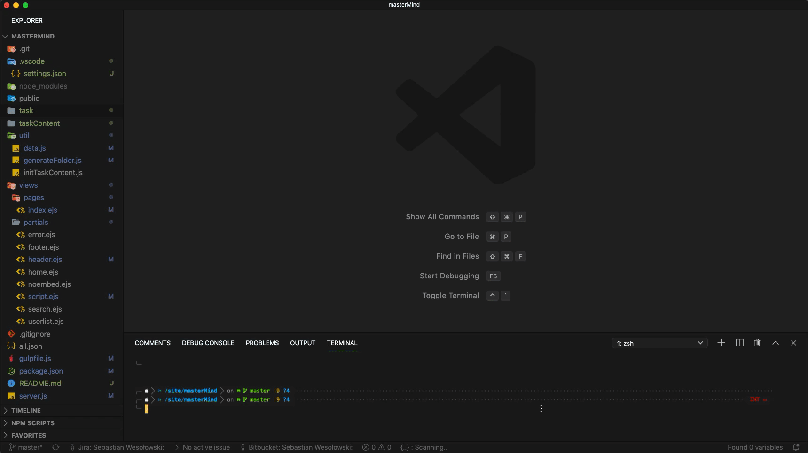
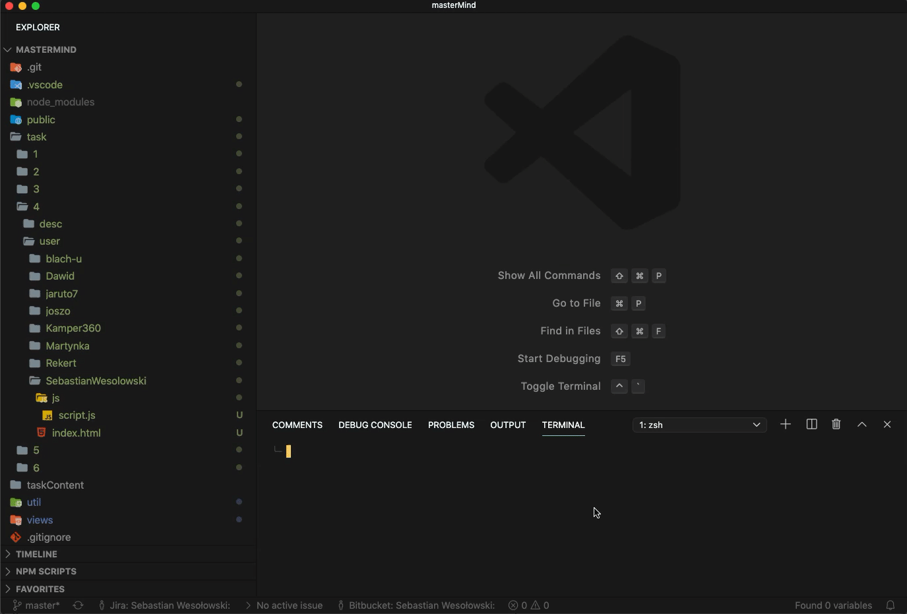
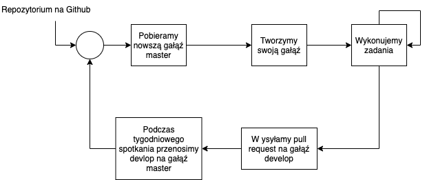

# Informacja wstępna

Miejsce do zbierania naszych zadań

## Wymagania

Upewnij się, że wszystkie zależności zostały zainstalowane, zanim przejdziesz dalej:

- [Node.js](http://nodejs.org/) >= 12.0.0
- Package menager
  - [Npm](https://docs.npmjs.com/cli/install)
  - [Yarn](https://yarnpkg.com/en/docs/install)

## Jak zacząć

Przede wszystkim instalujemy wszystkie zależności

```shell
$ npm install
```

### Chcę po prostu zrobić zadanie

Uruchom serwer poprzez skrypt zapisany w pliku package.json

[Uruchom terminal](https://code.visualstudio.com/docs/editor/integrated-terminal) wbudowany w edytor kodu Visual studio code

```shell
$ npm run start
```



Przejdź do swojego folderu z zadaniem. Przykład zadania nr 2 dla użytkownika SebastianWesolowski:

task/2/user/SebastianWesolowski

Zacznij po prostu pisać kod. Po zapisaniu w terminalu wyświetlą się wszystkie consol logi oraz odświeży się sama aplikacja dostępna pod adresem http://localhost:5000


### Chcę po prostu zrobić zadanie v2

Jeśli potrzebujesz tylko terminala do wykonania zadań i nie będziesz korzystać z API przeglądarki można użyć paczki [nodemon](https://www.npmjs.com/package/nodemon):

Przechodzimy do katalogu ze skryptem i odpalamy komendę

```shell
$ nodemon script.js
```



### Chcę Dodać użytkownika

> To jest tylko opcja dodatkowa, by ułatwić zażądanie aplikacją. Prawdopodobnie nie jest Ci potrzeba :)

Wystarczy rozszerzyć obiekt w pliku [userData.json](./userData.json) wdłóg wzoru w pliku.

Następnie wywołujemy komendę

```shell
$ npm run createUserCatalog
```

Node utworzy nam całą hierarchię plików dla danego użytkownika oraz stworzy katalogi dla poszczególnych zadań

### Chcę Dodać nowe zadanie

> To jest tylko opcja dodatkowa, by ułatwić zażądanie aplikacją. Prawdopodobnie nie jest Ci potrzeba :)

Wystarczy rozszerzyć obiekt w pliku [taskData.json](./taskData.json) wdłóg wzoru w pliku.

Następnie wywołujemy komendę

```shell
$ npm run initTaskContent
```

Zostanie stworzony nowy plik w katalogu ./taskContent/<numer taskId zadania>

Należy wypełnić treść zadania w pliku script.js i następnie wywołać skrypt tworzenia katalogów dla użytkowników, by rozpropagować dane zadanie dla wszystkich użytkowników.

```shell
$ npm run createUserCatalog
```

## Zrobiłem zadanie co dalej ?

Założenie aplikacji jest takie, że służy ona do prostego przeglądu wszystkich rozwiązań danego zadania. By było to możliwe, musimy mieć wszystkie zadania w jednym miejscu.

### GitHub

Po zrobieniu Zadania lub partii zadań należy wysłać je do GitHub

## Workflow pracy

- pobieramy repozytorium z GitHub
- tworzymy swoją gałąź od aktualnej wersji master
- wykonujemy swoje zadania
- wysyłamy swoje zadania na GitHub
- wykonujemy pullrequest na branch develop
- podczas tygodniowego spotkania omawiamy wersje develop i łączymy ją z branch master
- i lecimy dalej z następnymi zadaniami


